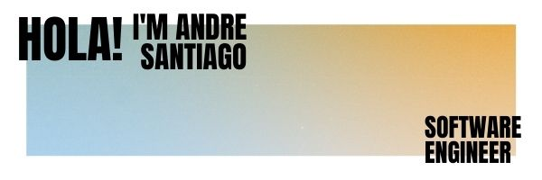

### Hi, I'm André! 👋

I'm a former Senior Network Engineer (6+ years of experience) turned Software Engineer (2+ years of experience). I decided to pivot and change careers when I felt that I wasn't satisfied – I quit, traveled, and returned to attend a coding bootcamp. I never looked back, and I've never been happier. In fact, my only regret is that I didn't make this career change sooner. I'm currently now looking for new opportunities in which I can continue to learn and grow into a better developer. Ideally, I'd love to be in the pet tech or health space.

- 🔭 I’m currently working on bolstering my portfolio with new projects in order to sharpen my React (with Hooks) and Styled components skills
- 🌱 I’m currently learning Firebase
- 👯 I’m looking to collaborate on building an application to help Fantasy Football players decide on +/- matchups dependent on positions and where a defense fails
- 🤔 I’m looking for help with finding a gig in which I can combine my love for coding and passion for dogs or health
- 💬 Ask me about health, fitness, and/or travel stories!
- 📫 How to reach me: the.asantiagojr@gmail.com
- 😄 Pronouns: he/him
- ⚡ Fun fact: I've fostered several dogs successfully, and I've completed several marathons and have competed in multiple powerlifting competitions

